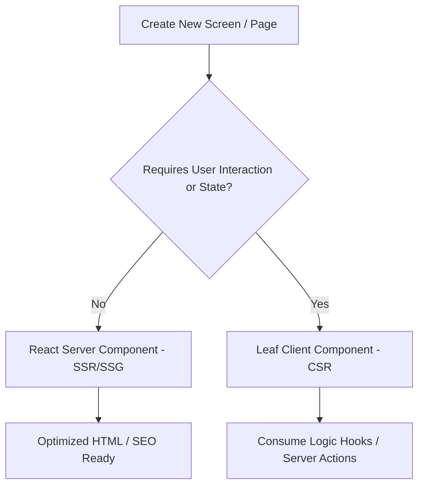

# NextBoi Coding Standards

This document establishes the styling, formatting, and programming guidelines to maintain high-quality code across the codebase.

---

## 1. TypeScript Coding Standards

NextBoi uses strict TypeScript type checking.

### Type Declarations
- **No `any`**: The use of `any` is forbidden. If a type is unknown, use `unknown` and perform runtime checking or assertions.
- **Explicit Returns**: Always declare return types for exported functions, especially API handlers, async services, and hooks.
- **Interfaces vs Types**:
  - Use `interface` for structural object shapes (such as props, database records, and server payloads).
  - Use `type` for union types, aliases, and simple mapped values.

```typescript
// Good
export interface UserProfile {
  id: string;
  email: string;
  role: "admin" | "user";
}

// Avoid
export type UserType = {
  id: any;
  email: string;
};
```

### Safety and Null Guards
- Validate API payloads with Zod schemas.
- When dealing with interactive elements (such as selects and form inputs), handle nullable parameters explicitly.

---

## 2. Tailwind CSS v4 Styles

Tailwind CSS v4 is configured CSS-first. All configurations live in `src/app/globals.css`.

### Core Guidelines
- **Custom Theme**: Add customized tokens inside the `@theme inline` block in `globals.css`.
- **OKLCH Colors**: Define themes with `oklch` color spaces for cleaner hues.
- **Glassmorphism**: Use established utility classes instead of writing custom inline backdrop styles:
  - `glass-panel`: Frost backdrop, low border opacity, subtle shadow.
  - `glass-card`: Glass panel with transitions and hover transformations.
- **Grid Layouts**: Construct layouts using bento-style grids (`grid grid-cols-1 md:grid-cols-3 gap-6`) or flexible columns.

---

## 3. Formatting and Linting (Biome)

We use **Biome** instead of ESLint/Prettier for lightning-fast compilation, formatting, and lint checks.

### Biome Enforcement
- Run `bun run check` before pushing commits to verify all code passes the formatter and linter rules.
- **Import Sorting**: Biome automatically sorts and formats imports on write. Keep imports structured:
  1. React and Next imports
  2. Lucide icons and third-party libraries
  3. UI primitives and components
  4. Local hooks, services, and schemas
  5. Stylesheets

---

## 4. React 19 & Next.js 16 Rendering Modes

React 19 and Next.js 16 support server-first layouts by default. Select render modes according to efficiency.

### Choosing Render Modes (RSC vs Client)
- **React Server Components (RSC) (SSR/SSG)**: Use as the default wrapper for all layout screens, SEO metadata configurations, static wrappers, and page trees.
- **Client Components (CSR) (`"use client"`)**: Use strictly at leaf node components requiring interactive states (like input fields, click buttons, selectors, slider drawers).
- **Hybrid Pattern**: If a page has complex client states, isolate the interactive states inside a separate Client Component rather than converting the parent server page to a Client Component.



---

## 5. UI and Logic Separation

To keep the codebase maintainable and components easy to style, separate visual code (TSX layout) from logic states (React hooks, state configurations, query mutations).

### Guidelines
- **Zero Complex Hooks in UI**: Do not write complex `useState`, `useForm`, or database mutation hooks directly inside the layout component.
- **Logic Hooks**: Extract all state management, validators, and callback handlers into a custom hook named `use[ComponentName]Logic` and place it under a `hooks/` directory. The UI component should only import and consume variables from this hook.

---

## 6. DOM Node Efficiency

Minimize tag nesting for faster page rendering speeds.

### Guidelines
- **Minimize wrapper `div` tags**: Avoid wrapping layouts with redundant container `div` tags. Use CSS flex, grid gap spacing, or semantic layout elements (like `<section>`, `<article>`) directly instead of nesting wrapper divs.
- **Semantic HTML**: Use native HTML5 tags (e.g. `<header>`, `<main>`, `<footer>`, `<nav>`) to represent structural landmarks instead of generic styled blocks.
- **Card Borders & Outlines**: Never combine outline rings (`ring-*`) with layout borders (`border-*`) on the same container to avoid double-border rendering artifacts at rounded corners. Keep card containers clean, delegating padding to child elements (`CardHeader` and `CardContent` using standard `p-6`).

---

## 7. Testing Standards (Playwright)

NextBoi uses Playwright for comprehensive End-to-End (E2E) testing.

### Guidelines
- **Directory**: All E2E test suites live in the root `./tests/` directory.
- **File Naming**: Tests must end with `.spec.ts` (e.g., `landing-page.spec.ts`).
- **Assertion Scoping**: Avoid strict-mode violations by scoping locators to parent containers (like `page.locator("header")`) when asserting general text classes that appear multiple times in the viewport.
- **Responsive Elements**: Avoid asserting visibility of elements that are styled to hide on small viewport sizes (e.g., `hidden xs:inline-flex`) unless the viewport size is explicitly configured in the test.

