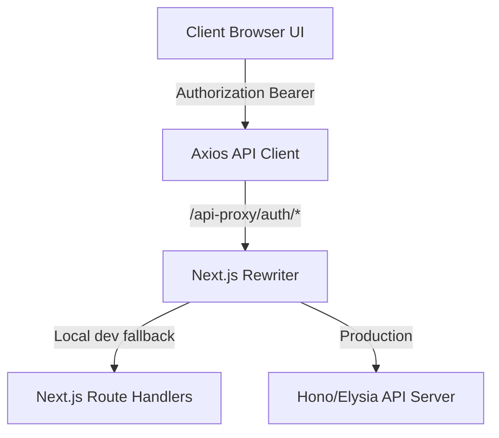

# Spec: Token-Based Authentication Setup with Simulated API

This specification details the implementation of a secure token-based authentication system for NextBoi. It is designed to work with an external Hono/Elysia backend in production while utilizing Next.js API Routes to simulate the backend contract for local development.

---

## 1. Core Architecture

The authentication system employs a hybrid flow:
1.  **AccessToken**: Short-lived JWT (simulated, valid for 5 minutes) stored in-memory (React State) to sign API requests via the `Authorization: Bearer <token>` header.
2.  **RefreshToken**: Long-lived token (valid for 7 days) stored in a secure, `HttpOnly`, `SameSite=Lax` cookie.
3.  **BFF Reverse-Proxy**: Axios routes all client-side requests through `/api-proxy/auth/*`, which Next.js rewrites to the backend API (`NEXT_PUBLIC_API_URL`). Locally, this will fall back to our simulated route handlers.



---

## 2. API Endpoint Contracts (Simulated Backend)

We will implement the following Route Handlers in Next.js to simulate the Elysia/Hono backend:

### A. Login
*   **Endpoint**: `POST /api/auth/login`
*   **Request Body**:
    ```json
    { "email": "user@example.com", "password": "password123" }
    ```
*   **Response Body (200 OK)**:
    ```json
    {
      "accessToken": "mock-access-token-xyz",
      "user": { "id": "1", "name": "Jekz Dev", "email": "user@example.com", "role": "admin" }
    }
    ```
*   **Cookie Sent**: `refresh_token=mock-refresh-token-123; HttpOnly; Secure; SameSite=Lax; Path=/`

### B. Token Refresh
*   **Endpoint**: `POST /api/auth/refresh`
*   **Request Cookie**: `refresh_token`
*   **Response Body (200 OK)**:
    ```json
    { "accessToken": "new-mock-access-token-abc" }
    ```
*   **Response (401 Unauthorized)**: If `refresh_token` is missing or invalid.

### C. Logout
*   **Endpoint**: `POST /api/auth/logout`
*   **Response (200 OK)**: Clears the `refresh_token` cookie.

### D. Current User Details
*   **Endpoint**: `GET /api/auth/me`
*   **Request Header**: `Authorization: Bearer <token>`
*   **Response Body (200 OK)**: User profile details.

---

## 3. Frontend Integration

### A. Auth Context & Hooks (`src/features/auth/`)
We will create a self-contained feature folder under `src/features/auth/` containing:
1.  **`AuthContext`**: Context provider managing:
    *   `user`: Current logged-in user profile details (or `null`).
    *   `accessToken`: In-memory token string (or `null`).
    *   `isAuthenticated`: Helper boolean.
    *   `isLoading`: Loading boundary state during silent refresh.
    *   `login(email, password)` / `logout()` / `register(...)` methods.
2.  **`useAuth`**: Custom hook for components to access authentication states.
3.  **Axios Interceptor**:
    *   In `src/lib/api-client.ts`, configure an interceptor for responses:
        *   If response returns `401` and has not been retried yet:
            1.  Pause current outgoing requests.
            2.  Perform a POST to `/api-proxy/auth/refresh`.
            3.  If successful, save the new `accessToken` in memory, update the header, and replay all paused requests.
            4.  If refresh fails (e.g. cookie expired), clear the auth state and redirect the user to `/login`.

### B. Route Protection (Middleware)
*   **`src/middleware.ts`**: Read a lightweight `session_active` cookie (non-HttpOnly, set by frontend during login).
*   If a user tries to access `/dashboard` without `session_active=true`, redirect them to `/login`.
*   *(Using a non-HttpOnly cookie for Middleware allows static layout protection on the server-side without needing to unpack/verify encrypted HttpOnly JWTs directly in Vercel Edge runtime).*

---

## 4. UI/UX Design

1.  **Navbar Actions**:
    *   If guest: Render a glassmorphic "Masuk" (Sign In) button.
    *   If logged in: Render an avatar dropdown with links to "Dashboard", "Profil", and "Keluar" (Sign Out) utilizing `@base-ui` dropdown primitive.
2.  **Auth Pages**:
    *   `/login`: Sleek glassmorphic card interface featuring email/password fields, input focus states, validation states (Zod + React Hook Form), and social login buttons (mocked).
    *   `/register`: Corresponding sign-up page.
3.  **Dashboard page (`/dashboard`)**:
    *   Create a simple protected route `/dashboard` rendering a glassmorphic dashboard frame to showcase route protection.

---

## 5. Verification Plan

### Automated Tests
1.  **Playwright Tests** in `tests/auth.spec.ts`:
    *   Verify guest users cannot access `/dashboard` and are redirected to `/login`.
    *   Verify entering correct credentials authenticates the user, navigates to `/dashboard`, and displays their name in the navbar.
    *   Verify token expiration: Simulate a `401` error response and verify Axios interceptor silent-refreshes the token and recovers the session without user intervention.
    *   Verify clicking "Keluar" signs the user out, clears cookies, and redirects them to the landing page.

### Manual Verification
*   Inspect cookies tab in Chrome/Firefox DevTools to ensure `refresh_token` is marked as `HttpOnly`, `Secure`, and `SameSite=Lax`.
